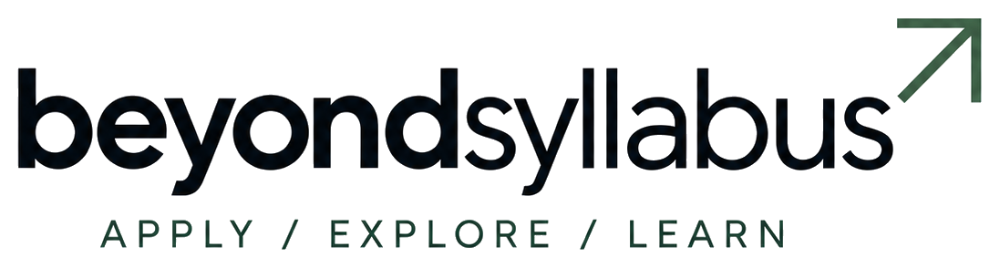

<div align="center">
  <picture>
    <source media="(prefers-color-scheme: dark)" srcset="./aetheria-user-application/apps/users/public/beyond-syllabus-lockup-dark.png">
    
  </picture>

  <p><strong>A focused learning platform that turns Computer Networks material into notes, interactive revision, visual modules, and unit-based podcasts.</strong></p>

  <p>
    <a href="https://beyond-syllabus-learn.vercel.app"><strong>Live application</strong></a>
    ·
    <a href="https://beyond-syllabus-learn.vercel.app/notes">Course notes</a>
    ·
    <a href="https://beyond-syllabus-learn.vercel.app/learn">Learn for a Test</a>
    ·
    <a href="https://beyond-syllabus-learn.vercel.app/podcasts">Podcasts</a>
  </p>

  <p>
    
    
    
    
    
  </p>
</div>

---

## About the project

Beyond Syllabus is an independent education platform built to make technical course material easier to understand, revise, and apply. The current release focuses on **Computer Networks** and connects five original interactive unit applications with a modern study experience.

The project goes beyond displaying static notes. Learners can move from structured explanations to question-bank practice, flashcards, authored recall, visual simulations, and long-form audio—all within one responsive interface.

> Beyond Syllabus is an independent educational project and is not an official university or institutional platform.

## What learners can do

| Experience | What it provides |
| --- | --- |
| **Course notes** | Structured Computer Networks content organized across five units |
| **Original unit modules** | Existing interactive applications preserved and integrated into the learning platform |
| **Learn for a Test** | Unit-specific quizzes, flashcards, and written-answer recall based on the supplied question bank |
| **Course podcasts** | A unit-based audio player with seeking, 15-second controls, playback speed, and downloads |
| **Reading preferences** | Light, sepia, and dark themes with adjustable reading support |
| **Responsive experience** | Desktop, tablet, and mobile layouts with accessible touch targets and navigation |
| **Study assistance** | Grounded AI responses when an API provider is configured |
| **Personal workspace** | Registration, email verification, authentication, and saved learner context |
| **Offline support** | Installable PWA behavior with an offline fallback |

## Current Computer Networks coverage

| Unit | Integrated source | Status |
| ---: | --- | --- |
| 1 | `CN-Unit` | Available |
| 2 | `CN-Unit-two` | Available |
| 3 | `CN-Unit-3` | Available |
| 4 | `CN-unit-4` | Available |
| 5 | `CN-Unit-5` | Available |

The five source applications are compiled into the host project during the build. Their original educational content, controls, and simulation behavior remain separated from the surrounding Beyond Syllabus interface.

## Technology

- **Application:** Next.js 15, React 19, TypeScript
- **Styling:** Tailwind CSS 4 and shared semantic CSS tokens
- **Database:** MySQL with Prisma ORM
- **Authentication:** NextAuth-based account flows with Argon2 password hashing
- **Content:** Markdown, React Markdown, KaTeX, and structured question-bank data
- **Workspace:** pnpm workspaces and Turborepo
- **Testing:** Vitest, Playwright, and axe-core
- **Icons:** Lucide React
- **Hosting:** Vercel
- **Large media:** Git LFS

## Repository structure

```text
College-Ext/
├── CN-Unit/                         # Original Computer Networks Unit 1
├── CN-Unit-two/                     # Original Computer Networks Unit 2
├── CN-Unit-3/                       # Original Computer Networks Unit 3
├── CN-unit-4/                       # Original Computer Networks Unit 4
├── CN-Unit-5/                       # Original Computer Networks Unit 5
└── aetheria-user-application/
    ├── apps/users/                  # Learner-facing Next.js application
    ├── packages/ai/                 # Grounded study-response utilities
    ├── packages/auth/               # Authentication services
    ├── packages/database/           # Database package
    ├── packages/ui/                 # Shared design system and styles
    ├── packages/validation/         # Shared validation schemas
    ├── prisma/                      # Schema, migrations, and seed data
    ├── tests/                       # Automated test suites
    └── tooling/                     # Build, database, mail, and course tools
```

## Local development

### Requirements

- Node.js **22 or later**
- pnpm **11**
- MySQL Server **8.4**
- Git LFS
- Windows PowerShell for the included local MySQL helper

### 1. Clone the repository

```bash
git clone https://github.com/Mohith2912/College-Ext.git
cd College-Ext
git lfs install
git lfs pull
```

Git LFS retrieves the Unit 1 podcast recording. Without it, the repository contains only the media pointer file.

### 2. Install dependencies

```powershell
cd aetheria-user-application
pnpm install
```

### 3. Configure the environment

```powershell
Copy-Item .env.example .env
```

Update `.env` with secure local values:

| Variable | Purpose | Required |
| --- | --- | :---: |
| `DATABASE_URL` | MySQL connection string | Yes |
| `AUTH_SECRET` | Authentication signing secret of at least 32 random characters | Yes |
| `USERS_URL` | Public URL of the learner application | Yes |
| `ORGANIZATION_SLUG` | Organization scope used by the curriculum | Yes |
| `SMTP_HOST`, `SMTP_PORT`, `SMTP_FROM` | Verification-email delivery | Yes |
| `SMTP_USER`, `SMTP_PASSWORD` | SMTP credentials for hosted environments | Production |
| `AI_BASE_URL` | OpenAI-compatible API base URL | AI features |
| `AI_API_KEY` | Server-side AI provider key | AI features |
| `AI_MODEL` | Model used for grounded study responses | AI features |

Never commit `.env`, API keys, database passwords, or SMTP credentials.

### 4. Prepare the database

```powershell
pnpm db:setup
pnpm db:migrate
pnpm db:seed
```

The database helper runs MySQL locally on port `3307` using the values from `.env`.

### 5. Start development

```powershell
pnpm dev
```

- Learner application: `http://localhost:3000`
- Development email inbox: `http://localhost:8025`

## Useful commands

Run these commands from `aetheria-user-application`.

| Command | Purpose |
| --- | --- |
| `pnpm dev` | Start the application and local development services |
| `pnpm build` | Build all required workspace packages and the user application |
| `pnpm start:users` | Start the production build locally |
| `pnpm lint` | Run ESLint across the workspace |
| `pnpm typecheck` | Run TypeScript checks through Turborepo |
| `pnpm test` | Run package builds and Vitest tests |
| `pnpm test:e2e` | Run Playwright end-to-end tests |
| `pnpm format:check` | Verify Prettier formatting |
| `pnpm db:validate` | Validate the Prisma schema |
| `pnpm db:migrate` | Apply committed Prisma migrations |
| `pnpm db:seed` | Seed the local curriculum and demonstration data |
| `pnpm db:start` | Start the local MySQL service |
| `pnpm db:stop` | Stop the local MySQL service |

## Verification before a contribution

```powershell
pnpm db:validate
pnpm lint
pnpm typecheck
pnpm test
pnpm build
```

Run `pnpm test:e2e` when a change affects navigation, authentication, accessibility, or interactive learning flows.

## Deployment

The production application is deployed on Vercel:

**[beyond-syllabus-learn.vercel.app](https://beyond-syllabus-learn.vercel.app)**

The Vercel project builds the `@aetheria/users` workspace together with its internal package dependencies. Production configuration must provide the database, authentication, SMTP, organization, and optional AI environment variables listed above.

Before deploying:

1. Ensure the production database is reachable.
2. Add all required environment variables in Vercel.
3. Confirm Git LFS objects are available to the deployment source.
4. Run the production build locally.
5. Verify `/notes`, `/learn`, and `/podcasts` after deployment.

## Content and data principles

- The uploaded question bank is the source used for Computer Networks test preparation.
- AI keys and generated-response logic remain server-side.
- Generated study answers should be grounded in published course material.
- Fictional case studies must remain clearly identified as fictional.
- Replace demonstration content only with original, licensed, or authorized material.
- Do not commit private learner data or production database exports.

## Contributing

1. Create a focused branch from `main`.
2. Keep each commit limited to one logical change.
3. Preserve the original Computer Networks unit applications unless a task explicitly requires changing them.
4. Add or update tests for behavioral changes.
5. Run the relevant verification commands.
6. Open a pull request describing the learner impact and validation performed.

Use an email address associated with your GitHub account—or your GitHub `noreply` address—so commits appear correctly in your contribution history.

## Roadmap

- Add reviewed podcasts for Computer Networks Units 2–5
- Expand question-bank-driven revision to additional courses
- Add learner progress and completion tracking
- Improve offline access to selected study material
- Add educator-facing curriculum management tools

## Project status

Beyond Syllabus is under active development. The Computer Networks learning experience is live, while additional course content and educator workflows are planned.

---

<div align="center">
  <strong>Beyond Syllabus</strong><br>
  Apply · Explore · Learn
</div>
